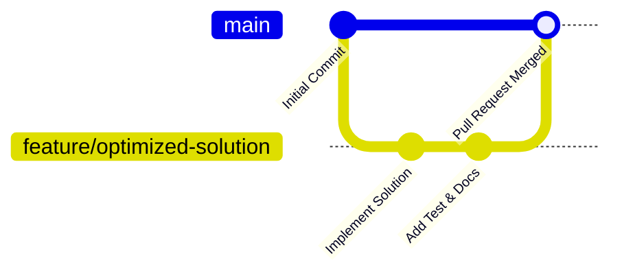

<div align="center">

# ☕ Data Structures & Algorithms in Java
### *A Production-Grade Self-Study Curriculum & Code Repository for Software Engineering Interviews*

[](https://www.oracle.com/java/)
[](./LICENSE)
[](#-contributing)
[](./course.md)
[](./course.md)

<p align="center">
  <a href="#-overview">Overview</a> •
  <a href="#-repository-structure">Architecture</a> •
  <a href="#-curriculum-roadmap">Curriculum</a> •
  <a href="#-getting-started">Getting Started</a> •
  <a href="#-code-standards--conventions">Code Standards</a> •
  <a href="#-contributing">Contributing</a> •
  <a href="#-license">License</a>
</p>

---

</div>

## 📌 Overview

This repository is an engineered, step-by-step masterclass in **Java Programming and Data Structures & Algorithms (DSA)**. Curated for software engineering students and aspiring developers targeting Tier-1 tech and product companies (FAANG/MAANG), it bridges the gap between basic syntax and high-performance algorithmic problem solving.

### 🌟 Why This Repository?

- **Zero External Dependencies**: Built entirely with pure standard Java (JDK), emphasizing core principles before leveraging abstraction.
- **Package-Isolated Architecture**: Scalable, modular structure preventing namespace collision across 39 distinct chapters.
- **Interview-Aligned Prioritization**: High-yield problem classification based on frequency in technical interview loops.
- **Interactive Tracking**: Seamless progress monitoring integrated directly through [`course.md`](./course.md).

---

## 📂 Repository Structure

The codebase is organized into modular packages corresponding to thematic chapters:

```plaintext
java_DSA/
├── .gitignore                   # Standard Java & IDE build exclusion rules
├── course.md                    # 39-module self-study roadmap & progress checklist
├── README.md                    # Repository documentation and setup instructions
│
├── chapter_01/                  # Module 1: Introduction to Java Language
│   └── introduction.java        # Syntax foundations, bytecode execution & I/O
│
├── chapter_02/                  # Module 2: Variables, Types & Memory Layout
│   └── ...                      # Primitive data types, Scanner I/O, typecasting
│
├── chapter_03/                  # Module 3: Control Flow & Conditional Logic
│   └── ...                      # If-Else branching, switch expressions
│
└── ...                          # Modules 04 through 39 (Trees, Graphs, DP, etc.)
```

> [!NOTE]
> All source files declare their respective package namespace (e.g., `package chapter_01;`). Commands must be executed from the workspace root to preserve Java's classpath resolution.

---

## 🗺️ Curriculum Roadmap

The course is divided into **7 comprehensive phases** comprising **39 core modules**. Progress can be actively tracked inside [`course.md`](./course.md).

<details open>
<summary><b>Phase 1: Language Fundamentals & Programming Constructs (Lessons 1–8)</b></summary>
<br/>

| Lesson | Topic | Focus Areas | Rating |
|:---:|---|---|:---:|
| `01` | **Introduction to Java** | JVM architecture, JRE vs JDK, compilation lifecycle | ⭐⭐⭐⭐ |
| `02` | **Variables & Data Flow** | Data types, memory allocation, `Scanner` input | ⭐⭐⭐⭐ |
| `03` | **Conditional Statements** | `if-else`, ternary expressions, `switch` pattern matching | ⭐⭐⭐⭐⭐ |
| `04` | **Iteration & Loops** | `for`, `while`, `do-while`, nested loops, loop control | ⭐⭐⭐⭐⭐ |
| `05` | **Pattern Problems (Core)** | Matrix manipulation, triangle & pyramid geometries | ⭐⭐⭐ |
| `06` | **Advanced Pattern Logic** | Symmetrical, palindromic, and hollow patterns | ⭐⭐ |
| `07` | **Functions & Methods** | Method signatures, call stack, pass-by-value semantics | ⭐⭐⭐⭐⭐ |
| `08` | **Functions Practice** | Modular program design and algorithmic helper functions | ⭐⭐⭐⭐ |

</details>

<details>
<summary><b>Phase 2: Complexity, Linear Collections & Strings (Lessons 9–15)</b></summary>
<br/>

| Lesson | Topic | Focus Areas | Rating |
|:---:|---|---|:---:|
| `09` | **Time & Space Complexity** | Big-O, Big-Ω, Big-Θ notation, asymptotic runtime analysis | ⭐⭐⭐⭐⭐ |
| `10` | **1D Arrays** | Contiguous memory allocation, traversals, in-place operations | ⭐⭐⭐⭐⭐ |
| `11` | **2D Arrays & Matrices** | Row-major layout, matrix rotations, spiral traversals | ⭐⭐⭐⭐ |
| `12` | **String Fundamentals** | String pool, immutability, pattern searching algorithms | ⭐⭐⭐⭐⭐ |
| `13` | **StringBuilder & Buffers** | Dynamic character arrays, amortized resizing, performance | ⭐⭐⭐ |
| `14` | **Operators & Bitwise Math** | Two's complement representation, bit shifts, masks | ⭐⭐⭐ |
| `15` | **Bit Manipulation** | Power of two detection, XOR swaps, subset generation | ⭐⭐⭐⭐ |

</details>

<details>
<summary><b>Phase 3: Sorting, Recursion & Exhaustive Search (Lessons 16–23)</b></summary>
<br/>

| Lesson | Topic | Focus Areas | Rating |
|:---:|---|---|:---:|
| `16` | **Elementary Sorting** | Bubble Sort, Selection Sort, Insertion Sort ($O(N^2)$) | ⭐⭐⭐⭐ |
| `17` | **Recursion (Level 1)** | Base conditions, recursion tree visualization, call stack | ⭐⭐⭐⭐⭐ |
| `18` | **Recursion (Level 2)** | Subsets, sub-sequences, divide-and-conquer problems | ⭐⭐⭐⭐⭐ |
| `19` | **Recursion (Level 3)** | Tower of Hanoi, pathfinding, combinatorial puzzles | ⭐⭐⭐⭐ |
| `20` | **Backtracking Fundamentals**| State-space trees, N-Queens problem, string permutations | ⭐⭐⭐⭐ |
| `21` | **Sudoku Solver** | Constraint satisfaction, grid validation backtracking | ⭐⭐⭐ |
| `22` | **Merge Sort** | Stable divide-and-conquer, external sorting ($O(N \log N)$) | ⭐⭐⭐⭐⭐ |
| `23` | **Quick Sort** | In-place partition algorithms, pivot selection strategy | ⭐⭐⭐⭐⭐ |

</details>

<details>
<summary><b>Phase 4: Object-Oriented Engineering & Collections (Lessons 24–26)</b></summary>
<br/>

| Lesson | Topic | Focus Areas | Rating |
|:---:|---|---|:---:|
| `24` | **Java OOPs Deep Dive** | Encapsulation, Inheritance, Polymorphism, Abstraction | ⭐⭐⭐⭐⭐ |
| `25` | **ArrayList Internals** | Dynamic array resizing mechanics, amortized complexity | ⭐⭐⭐⭐ |
| `26` | **Collections Framework** | `List`, `Set`, `Queue`, `Map` interfaces, generics, iterators | ⭐⭐⭐⭐ |

</details>

<details>
<summary><b>Phase 5: Classical Linear Data Structures (Lessons 27–31)</b></summary>
<br/>

| Lesson | Topic | Focus Areas | Rating |
|:---:|---|---|:---:|
| `27` | **Linked Lists Intro** | Node pointers, singly vs doubly linked architectures | ⭐⭐⭐⭐⭐ |
| `28` | **Reverse Linked Lists** | Iterative pointer reversal, recursive reversal techniques | ⭐⭐⭐⭐⭐ |
| `29` | **Advanced Linked Lists** | Fast & Slow pointers, cycle detection (Floyd's algorithm) | ⭐⭐⭐⭐⭐ |
| `30` | **Stack Data Structure** | LIFO paradigm, custom array/node backing, monotonic stacks | ⭐⭐⭐⭐⭐ |
| `31` | **Queue Data Structure** | FIFO paradigm, circular queue, deque, sliding windows | ⭐⭐⭐⭐⭐ |

</details>

<details>
<summary><b>Phase 6: Non-Linear & Hierarchical Data Structures (Lessons 32–39)</b></summary>
<br/>

| Lesson | Topic | Focus Areas | Rating |
|:---:|---|---|:---:|
| `32` | **Binary Trees** | Node models, DFS traversals (In/Pre/Post), BFS level-order | ⭐⭐⭐⭐⭐ |
| `33` | **Binary Search Trees (BST)**| BST invariants, search, insertion, deletion, balancing | ⭐⭐⭐⭐⭐ |
| `34` | **HashSet Mechanics** | Hashing collision strategies, bucket hashing, set operations | ⭐⭐⭐⭐ |
| `35` | **HashMap Mechanics** | Key-Value hashing, load factor, rebucketing ($O(1)$ lookup) | ⭐⭐⭐⭐⭐ |
| `36` | **Custom HashMap** | Building a generic hash table with chaining from scratch | ⭐⭐⭐ |
| `37` | **Hashing Interview Problems**| Subarray sums, frequency maps, two-sum variations | ⭐⭐⭐⭐ |
| `38` | **Trie (Prefix Tree)** | Prefix dictionary, autocomplete, bitwise XOR trie | ⭐⭐⭐ |
| `39` | **Graph Data Structures** | Adjacency lists/matrices, BFS, DFS, Dijkstra, Topo-Sort | ⭐⭐⭐⭐⭐ |

</details>

---

## ⚙️ Prerequisites

Ensure your system meets the following standard development requirements:

| Tool | Version / Requirement | Recommendation |
|---|---|---|
| **Java Development Kit (JDK)** | JDK 17 or JDK 21 LTS | [Eclipse Temurin](https://adoptium.net/) or [Oracle JDK](https://www.oracle.com/java/technologies/downloads/) |
| **Integrated Development Environment (IDE)** | VS Code, IntelliJ IDEA, or Eclipse | [IntelliJ IDEA Community](https://www.jetbrains.com/idea/download/) or [VS Code](https://code.visualstudio.com/) |
| **Version Control** | Git 2.30+ | [Git Official](https://git-scm.com/) |

To verify your Java environment, execute:
```bash
java -version
javac -version
```

---

## 🚀 Getting Started

### 1. Clone the Repository

```bash
# Clone the repository via HTTPS
git clone https://github.com/AmitKumarPrasad1846/DSA_in_JAVA_by_Amit.git

# Navigate into the project root
cd DSA_in_JAVA_by_Amit
```

*(Alternatively, select **Code > Download ZIP** from GitHub and extract the archive to your local directory.)*

### 2. Compilation and Execution (CLI)

Because source files belong to specific chapter packages, always run compilation and execution commands from the **workspace root**:

```bash
# Step 1: Compile a specific source file
javac chapter_01/introduction.java

# Step 2: Execute using the fully-qualified class identifier
java chapter_01.introduction
```

> [!TIP]
> **Batch Compile All Classes in a Chapter:**
> ```bash
> # Linux / macOS / PowerShell:
> javac chapter_01/*.java
> ```

---

### 3. Running inside IDEs

<details>
<summary><b>Using Visual Studio Code</b></summary>
<br/>

1. Open VS Code: `File -> Open Folder...` and select the `java_DSA` directory.
2. Install the **Extension Pack for Java** by Microsoft.
3. Open any `.java` file.
4. Click the **Run** code lens button directly above `public static void main` or press `Ctrl + F5`.

</details>

<details>
<summary><b>Using IntelliJ IDEA</b></summary>
<br/>

1. Open IntelliJ IDEA: `File -> Open...` and select the root `java_DSA` folder.
2. Navigate to `File -> Project Structure -> Project` and ensure your installed JDK is configured.
3. Mark the root directory as the source root if prompted.
4. Right-click on any `.java` file or click the green gutter play icon next to the class name and choose **Run**.

</details>

---

## 📐 Code Standards & Conventions

To maintain clean and readable code across all modules, this repository adheres to the [Google Java Style Guide](https://google.github.io/styleguide/javaguide.html):

- **Package Naming**: Lowercase with snake_case numbers (e.g., `package chapter_01;`).
- **Class Naming**: Strict UpperCamelCase (e.g., `BinarySearchTree.java`, `MergeSort.java`).
- **Variable & Method Naming**: lowerCamelCase (e.g., `calculateSum()`, `maxProfit`).
- **Complexity Annotations**: Each major algorithmic solution should include asymptotic bounds:
  ```java
  /**
   * Time Complexity:  O(N log N)
   * Space Complexity: O(N)
   */
  ```

---

## 🤝 Contributing

We welcome contributions from developers, learners, and educators worldwide! Whether it's adding alternative algorithmic solutions, optimizing time complexity, fixing typos, or adding explanatory notes, your input is appreciated.

### Contribution Workflow



1. **Fork the Project**: Click the `Fork` button at the top right of this repository.
2. **Clone your fork**:
   ```bash
   git clone https://github.com/<your-username>/DSA_in_JAVA_by_Amit.git
   cd DSA_in_JAVA_by_Amit
   ```
3. **Create a Feature Branch**:
   ```bash
   git checkout -b feature/chapter-XX-topic-name
   ```
4. **Implement your Changes**:
   - Write idiomatic Java with self-explanatory comments.
   - Respect the package structure (`package chapter_XX;`).
   - Verify execution: compile and run before committing.
5. **Commit with Conventional Messages**:
   ```bash
   git commit -m "feat(chapter_02): add bitwise manipulation practice problems"
   ```
6. **Push to Your Remote Branch**:
   ```bash
   git push origin feature/chapter-XX-topic-name
   ```
7. **Submit a Pull Request**: Provide a concise summary of your addition, the problem source (if applicable), and its algorithmic complexity.

---

## 📜 License

This project is licensed under the **[Creative Commons Attribution-NonCommercial-ShareAlike 4.0 International License (CC BY-NC-SA 4.0)](./LICENSE)**.

```
Copyright (c) 2026 Amit Kumar Prasad and Project Contributors.

✅ Open for Community Use & Contributions:
   - Free for personal self-study, learning, and algorithmic practice.
   - Free for academic coursework, university research, and mentoring.
   - Open for pull requests, bug fixes, issue discussions, and community enhancements.

❌ Commercial Restrictions:
   - You may NOT use this material for commercial purposes.
   - Commercial purposes include: selling the code/notes, paywalling tutorials, bundling
     into paid bootcamps, or commercial distribution without prior written permission.
   - Any forks or adaptations must be shared under the same CC BY-NC-SA 4.0 license.
```

See the full [`LICENSE`](./LICENSE) file for complete legal details.

---

## ⭐ Show Your Support

If this repository accelerates your learning or helps you crack technical interviews:
- Give this repository a **Star ⭐** to help other students find it!
- Share it with your peers and study groups.
- Keep learning, keep practicing, and build great software! 🚀
